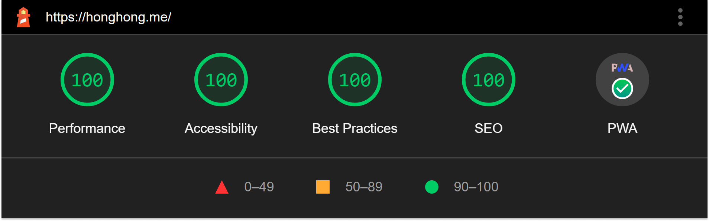

<h1 align="center">
 小康 blog
</h1>

<p align="center">
  
</p>

<p align="center">
    <a href="https://honghong.me" target="blank">View Demo</a>
    ·
    <a href="https://github.com/tszhong0411/honghong.me/issues/new/choose">Report Bug</a>
    ·
    <a href="https://github.com/tszhong0411/honghong.me/issues/new/choose">Request Feature</a>
</p>

## 🌍 honghong.me

- **Framework**: [Next.js](https://nextjs.org/)
- **Database**: [Planetscale](https://planetscale.com/)
- **ORM**: [Prisma](https://prisma.io/)
- **Authentication**: [NextAuth.js](https://next-auth.js.org/)
- **Deployment**: [Vercel](https://vercel.com)
- **Comment**: [Giscus](https://giscus.app/)
- **favicon**: [realfavicongenerator](https://realfavicongenerator.net/)
- **Content**: [MDX](https://mdxjs.com/)
- **Analytics**: [Umami](https://umami.is/)
- **UI**: [Mantine](https://mantine.dev)
- **Code syntax**: [Prism.js](https://prismjs.com/)

## 🚀 Demo

<a href="https://honghong.me" target="_blank">
  
</a>


## 🤩 Features

- Blog
- Projects
- About
- Guestbook
- i18n

## 👋 Running locally

1. Clone this repo

```sh
git clone https://github.com/tszhong0411/honghong.me.git
```

2. Change directory

```sh
cd honghong.me
```

3. Install yarn Packages

```sh
yarn
```

4. Create a .env.local and following the .env.example input some environment variables so that can run normally.

```txt
NEXT_PUBLIC_GISCUS_REPO=<Your env>
NEXT_PUBLIC_GISCUS_REPOSITORY_ID=<Your env>
NEXT_PUBLIC_GISCUS_CATEGORY=<Your env>
NEXT_PUBLIC_GISCUS_CATEGORY_ID=<Your env>

SPOTIFY_CLIENT_ID=<Your env>
SPOTIFY_CLIENT_SECRET=<Your env>
SPOTIFY_REFRESH_TOKEN=<Your env>

// ...
```

## 🛳️ Roadmap

- [x] Multi-language Support
  - [x] Traditional Chinese
  - [x] English

## 🍰 Contributing

Contributions are what make the open source community such an amazing place to learn, inspire, and create. Any contributions you make are **greatly appreciated**.

If you have a suggestion that would make this better, please fork the repo and create a pull request. You can also simply open an issue with the tag "enhancement".
Don't forget to give the project a star! Thanks again!

1. Fork the Project
2. Commit your Changes (`git commit -m 'Add some Feature'`)
3. Push to the Branch (`git push`)
4. Open a Pull Request

## ⭐ Lighthouse

<p align="center">
  <a href="https://googlechrome.github.io/lighthouse/viewer/?gist=50f0c8da918422944d8ee2e815eeecc1"></a>
</p>

Last updated: 2022-02-09 21:58

## ❤️ Credits

- [Tailwind nextjs starter blog template](https://github.com/timlrx/tailwind-nextjs-starter-blog) © [Timothy](https://www.timlrx.com/)

<hr>
<p align="center">
Made with ❤️ in Hong Kong
</p>
